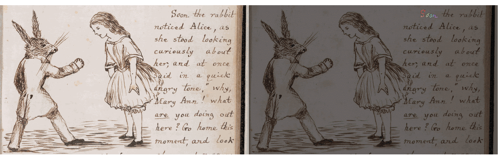
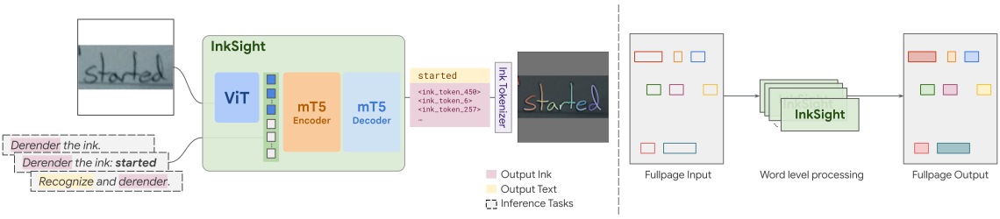

<p align="left">
  
</p>

# InkSight: Offline-to-Online Handwriting Conversion by Teaching Vision-Language Models to Read and Write

Source: https://github.com/google-research/inksight

<p align="center" style="font-size: 16px;">
    <a href="https://scholar.google.com/citations?user=L6rrZxAAAAAJ&hl=en"><strong>Blagoj Mitrevski&dagger;</strong></a> &bull; 
    <a href="https://github.com/arinaruck"><strong>Arina Rak&dagger;</strong></a> &bull; 
    <a href="https://scholar.google.com/citations?user=P02RNa8AAAAJ&hl=en"><strong>Julian Schnitzler&dagger;</strong></a> &bull; 
    <a href="https://scholar.google.com/citations?user=yTNl4IYAAAAJ&hl=en"><strong>Chengkun Li&dagger;</strong></a> &bull; 
    <a href="https://scholar.google.com/citations?user=QZd-fvAAAAAJ&hl=en"><strong>Andrii Maksai&ddagger;</strong></a> &bull; 
    <a href="https://scholar.google.com/citations?hl=en&user=CSHNLDcAAAAJ&view_op=list_works&sortby=pubdate"><strong>Jesse Berent</strong></a> &bull; 
    <a href="https://scholar.google.com/citations?user=n4bdAtIAAAAJ&hl=en"><strong>Claudiu Musat</strong></a>
</p>

<p align="center" style="font-size: 14px; color: #555;">
    <sup>&dagger;</sup> First authors (<a href="https://www.aeaweb.org/journals/policies/random-author-order/search?RandomAuthorsSearch%5Bsearch%5D=NEK4dy3K6mjr">random order</a>) &nbsp;&nbsp;|&nbsp;&nbsp; <sup>&ddagger;</sup> Corresponding author: <a href="mailto:amaksai@google.com">amaksai@google.com</a>
</p>

<p align="center">
  <a href="https://openreview.net/forum?id=pSyUfV5BqA">
    
  </a>
  <a href="https://arxiv.org/abs/2402.05804">
    
  </a>
  <a href="https://charlieleee.github.io/publication/inksight/">
    
  </a>
  <a href="https://huggingface.co/spaces/Derendering/Model-Output-Playground">
    
  </a>
  <a href="https://githubtocolab.com/google-research/inksight/blob/main/colab.ipynb">
    
  </a>
  <a href="https://research.google/blog/a-return-to-hand-written-notes-by-learning-to-read-write/">
    
  </a>
</p>

---

<p align="center">
  
<br>
  <em>Animated teaser</em>
</p>


## Overview

InkSight is an offline-to-online handwriting conversion system that transforms photos of handwritten text into digital ink through a Vision Transformer (ViT) and mT5 encoder-decoder architecture. By combining reading and writing priors in a multi-task training framework, our models process handwritten content without requiring specialized equipment, handling diverse writing styles and backgrounds. The system supports both word-level and full-page conversion, enabling practical digitization of physical notes into searchable, editable digital formats. In this repository we provide the model weights of Small-p, dataset, and example inference code.

**Key capabilities:**
- Offline-to-online handwriting conversion from photos
- Multi-language support with robust background handling
- Word-level and full-page text processing
- Vector-based digital ink output for editing and search

<div>
<p align="center">
  
<br>
  <em>InkSight system architecture (<a href="figures/full_diagram.gif">animated version</a>)</em>
</p>
</div>

## Latest Updates

- **June 2025**: Paper accepted to **[TMLR (Transactions on Machine Learning Research)](https://openreview.net/forum?id=pSyUfV5BqA)**
- **October 2024**: Model weights and dataset released on [Hugging Face](https://huggingface.co/Derendering/InkSight-Small-p)
- **October 2024**: Featured on [Google Research Blog](https://research.google/blog/a-return-to-hand-written-notes-by-learning-to-read-write/)
- **February 2024**: Interactive [demo](https://huggingface.co/spaces/Derendering/Model-Output-Playground) launched

## Quick Start

### Online Demo
Try InkSight on Hugging Face Space: [**Interactive Demo**](https://huggingface.co/spaces/Derendering/Model-Output-Playground)

### Jupyter Notebook
Explore our [**example notebook**](https://githubtocolab.com/google-research/inksight/blob/main/colab.ipynb) with step-by-step inference examples.

### Dataset
Access our comprehensive dataset: [**InkSight Dataset on Hugging Face**](https://huggingface.co/datasets/Derendering/InkSight-Derenderings)

## Installation

### Using uv (Recommended)

[uv](https://docs.astral.sh/uv/) is a fast Python package and project manager that provides excellent dependency resolution and virtual environment management.

```bash
# Install uv if you haven't already
curl -LsSf https://astral.sh/uv/install.sh | sh

# Clone and set up the project
git clone https://github.com/google-research/inksight.git
cd inksight
uv sync
```

### Using Conda

```bash
git clone https://github.com/google-research/inksight.git
cd inksight
conda env create -f environment.yml
conda activate inksight
```

> **Important**: Use TensorFlow 2.15.0-2.17.0. Later versions may cause unexpected behavior.

## Local Playground Setup

For development or custom inference, run the Gradio playground locally:

```bash
git clone https://huggingface.co/spaces/Derendering/Model-Output-Playground
cd Model-Output-Playground
pip install -r requirements.txt
python app.py
```


## Resources

### 📊 Dataset
- [**InkSight Dataset**](https://huggingface.co/datasets/Derendering/InkSight-Derenderings) - Comprehensive collection of model outputs and expert traces
- [**Dataset Documentation**](docs/dataset.md) - Detailed dataset description, format specifications, and usage guidelines

### 🤖 Models
- [**Small-p model (CPU/GPU)**](https://huggingface.co/Derendering/InkSight-Small-p) - Optimized for standard inference
- [**Small-p model (TPU)**](https://storage.googleapis.com/derendering_model/small-p-tpu.zip) - TPU-optimized version

### 💻 Code Examples
- [**Inference Notebook**](colab.ipynb) - Word and page-level inference examples
- [**Sample Outputs**](figures/) - Visual examples of model results

The inference code demonstrates both word-level and full-page text processing using open-source alternatives to commercial OCR APIs, including support for [docTR](https://github.com/mindee/doctr) and [Tesseract OCR](https://github.com/tesseract-ocr/tesseract).

## License and Citation

### License
This code is released under the [Apache 2.0 License](https://github.com/google-research/google-research/blob/master/LICENSE).

### Citation
If you use InkSight in your research, please cite our paper:

```bibtex
@article{
mitrevski2025inksight,
title={InkSight: Offline-to-Online Handwriting Conversion by Teaching Vision-Language Models to Read and Write},
author={Blagoj Mitrevski and Arina Rak and Julian Schnitzler and Chengkun Li and Andrii Maksai and Jesse Berent and Claudiu Cristian Musat},
journal={Transactions on Machine Learning Research},
issn={2835-8856},
year={2025},
url={https://openreview.net/forum?id=pSyUfV5BqA},
note={}
}
```

### Additional Resources
- [**Project Page**](https://charlieleee.github.io/publication/inksight/) - Comprehensive project overview with examples and technical details
- [**Google Research Blog**](https://research.google/blog/a-return-to-hand-written-notes-by-learning-to-read-write/) - Featured article explaining the research

---

*This is not an officially supported Google product.*
